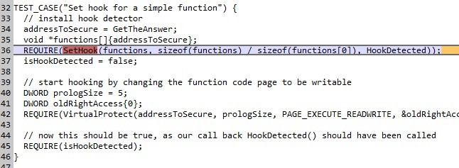
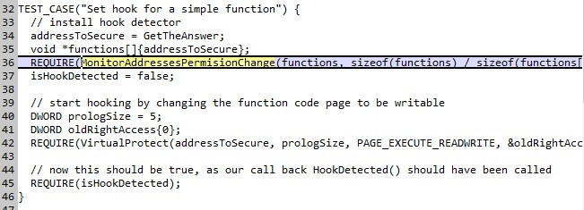
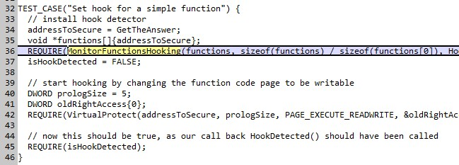

# TDD

--

### Test Driven Development

-- 

### Test Driven Desgin 

----

## Test 

--

## Why Test 
* Correctness
* Maintenance 
  * Regression detection
  * Refactoring
  * Add featuers
  * Fix bugs
* Code example
* Acceptence tests

----

## Driven

--

## Its the punch line 
## so not now

----

## Development

--

--

## Development
* Iterative -->
* Better understanding of the problem -->
* Enable refactoring -->
* Better code

----

## Driven

--

## Driven
* Don't implement - Use
* How to use? Write test first

--

## Result
  * Better API - Better *Design*
  * Simple:
    layziness --> simple short tests --> simpler API
  * API in user domein, not implementation domain 

----

## Hooking

--

--

--

