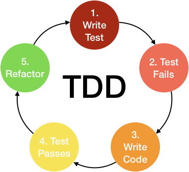

# TDD is NOT about tests (TFU)

TDD stands for Test Driven Development, or Test Driven Development.  
The first word people hear, and most of the time, the only word is TEST.  
Yes, they hear it out loud TEST!!!!  
And no body like to write tests. its boring, tedious, and non-constructive.  
You don't deliver it to the customer, its not a part of the software.  
On the other hand, most of us know the importance of tests (that we hate to write).  
Tests enable a Maintainable, Correct, Extensible, High-Quality, Reliable Buzzworded SW.  
These words, and then some, we all know and respect, but at the end of the day,  
WE DON"T WANT TO WRITE TESTS!!!!   

So.  

My lecture was about 2 things. 

## One: TDD is NOT about tests (TFU)    
TDD is about Development, and its about Design.  
TDD means a cycle of Test --> Code --> Reafctor --> Test --> ...  
  
Writing the tests BEFORE the code, give you a complete different point of view of the problem you here to solve.  
You are creating SW in means of the USE of the class\function and not in the means of the IMPLEMENTATION.  
The code become simpler and more concise as it defined by WHAT it does, and not HOW it do it.
A day to day example is a Microwave.  
We all know how to use it, its have a very simple interface,   
and most of us don't know and don't care HOW it work.  
The more our SW will resemble a Microwave, a Car, etc, maintaining it, extending it will be much better.

## Two: A library to the rescue
We now have an actual engineering solution to the UNFUN of writing tests.  
I introduce a C++ TDD library name [doctest](https://github.com/onqtam/doctest).
Its only one(!) header file (no lib\dll\configuration).  
There is NO boilerplate. No tedious macros as CPP_ASSERT_EQUAL, CPP_ASSET_LESS, ...  
The names of the tests are in plain text, not identifiers.
The are simple and declarative.
  ```cpp
  TEST_CASE("Factorial test")
  {
    int fact4 = Factorial(4);
	REQUIRE(fact4 == 1 * 2 * 3 * 4 * 5);
  }
```
and since this test fails, you get in your VS output window:
> c:\dev\TDDFactorial\tddfactorial.cpp(12): FATAL ERROR: REQUIRE( fact4 == 1 * 2 * 3 * 4 * 5 ) is NOT correct!
  values: REQUIRE( 8 == 120 )

It give you the the expressions and their values in the log, very nontrivial (in c\c++).  
There is a lot of more features to it, but all have the same result: **Simple non-tedious TDD.**


